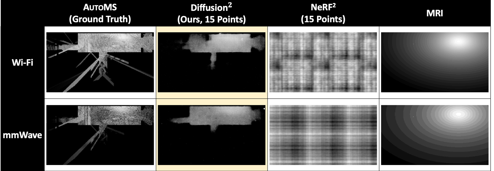
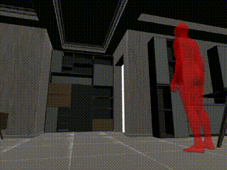

        <a href="https://github.com/RFVision-Project" target="_blank">
        The code and Dataset (Human Movement, 3D Rooms w/ AP, Wi-Fi, mmWave) will be uploaded to here
    </a>
    <h1>Overview</h1>
    

## RF Image

| Overshot  | 77 GHz |
|  :------:  | ----  |
|  |  |
|  |  |

**※ Note: Star icon  in overshot images represents the AP. it shows 10 different FMCW frequencies.**

## RF Video

|  |  |   |  |
|:-------------------------------------------:|---------------------------------------------|:-------------------------------------------:|---------------------------------------------|
|  |  |  |  |

## Real Experiment

### 1) Conference Room

### 2) Apartment

### 3) Office

**※ Note: Measurements were performed on the white box area.**

